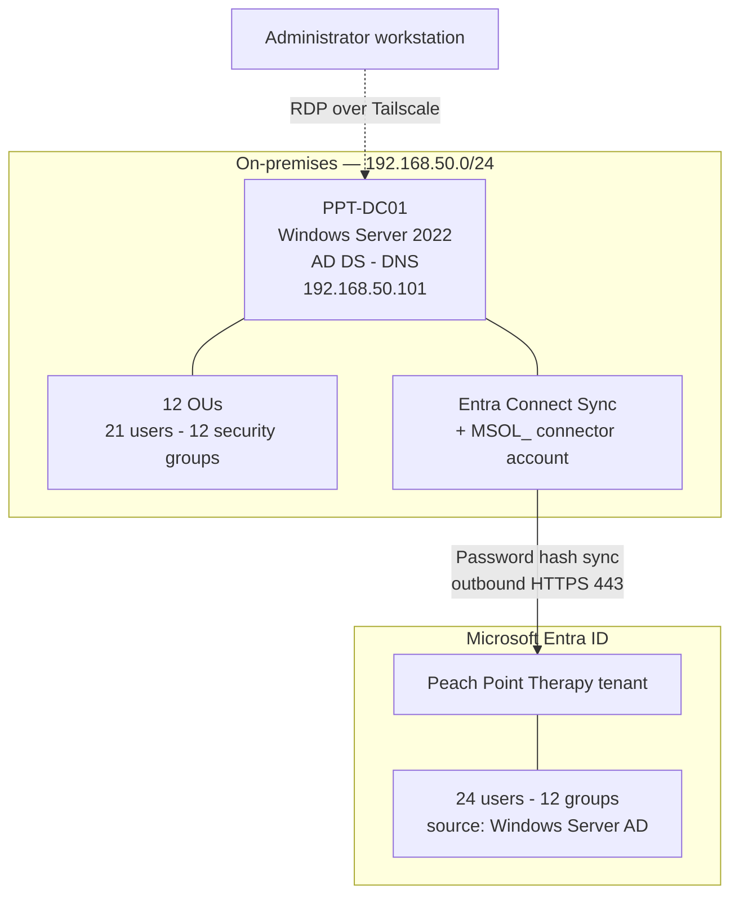
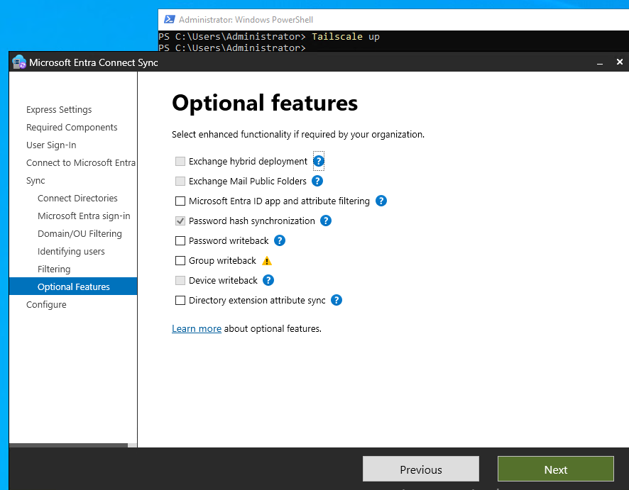
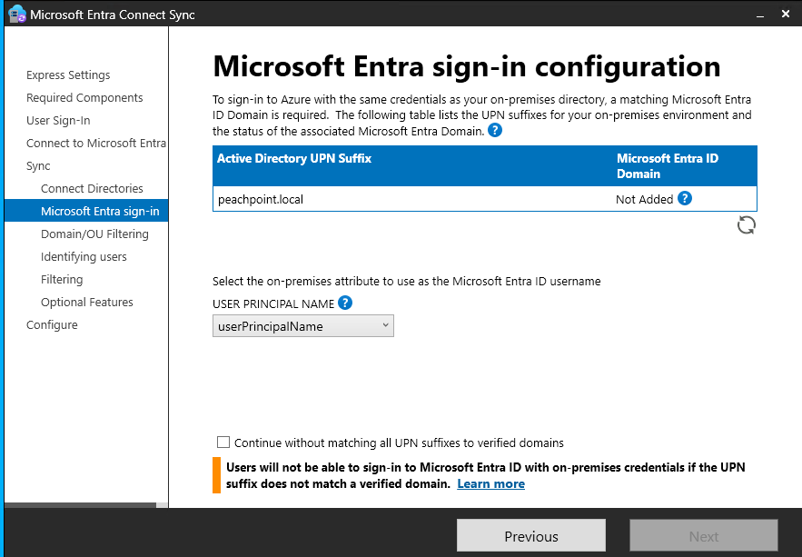
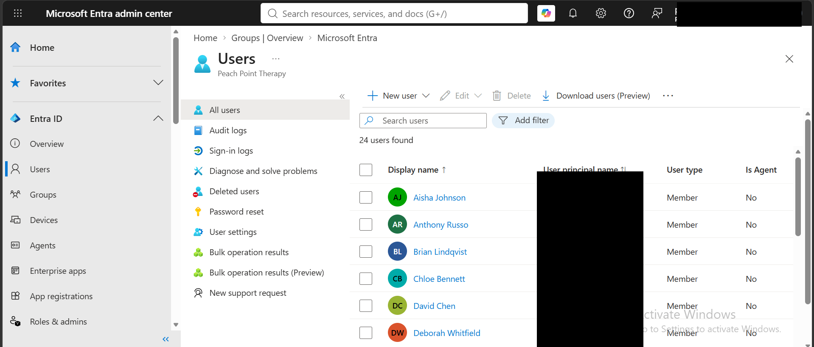
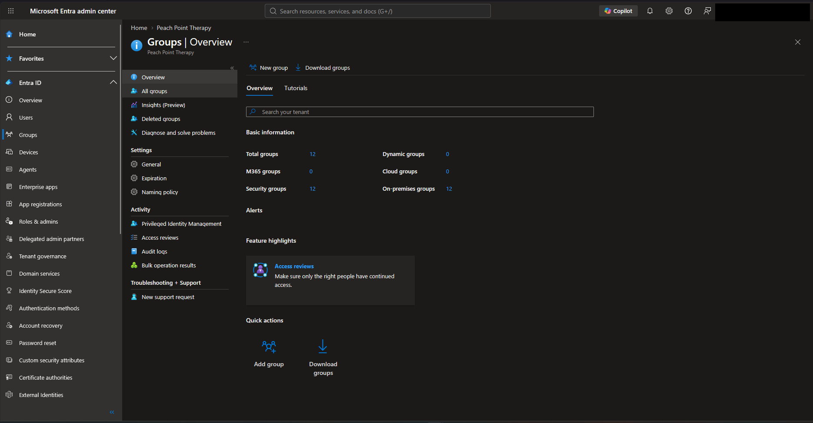

Hybrid Identity Lab — Peach Point Therapy

**On premises Active Directory Domain Services synchronized to Microsoft Entra ID
via Entra Connect Sync, with password hash synchronization.**


---

> ### About this project
>
> **Peach Point Therapy is a fictional organization.** It was designed as a lab
> scenario to model a realistic small size healthcare practice whose
> constraints drive genuine architectural decisions. All users, sites, and data
> are synthetic. No real patient data, client, or employer is involved.
>
> The organization is fictional; the infrastructure is not. Every component
> described here was built, configured, and validated on real hardware against a
> real Microsoft Entra ID tenant.

---

## At a glance

| | |
|---|---|
| **Domain controller** | `PPT-DC01` — Windows Server 2022, static `192.168.50.101` |
| **Forest / domain** | `peachpoint.local` (NetBIOS `PEACHPOINT`), new forest |
| **Directory structure** | 12 organizational units, site- and role-based |
| **Identity objects** | 21 staff accounts, 12 security groups |
| **Cloud tenant** | Microsoft Entra ID (tenant identifiers redacted) |
| **Sync engine** | Microsoft Entra Connect Sync |
| **Sign-in method** | Password Hash Synchronization |
| **Source anchor** | `mS-DS-ConsistencyGuid` |
| **Admin access** | RDP over Tailscale (WireGuard mesh) |

---

## Architecture



Synchronization is **outbound-only over HTTPS 443**. No inbound firewall rules, no
published endpoints, no DMZ. That is a deliberate property of the Connect Sync
model and one of the strongest arguments for it in a small practice environment:
the sync channel adds no external attack surface.

---

## The scenario in brief

Peach Point Therapy is a modeled outpatient physical and occupational therapy
practice running **three clinics** North, South, and West — with **21 staff**:
12 therapists, 4 administrative, 3 front desk, 1 billing, 1 office manager.

Five constraints drive every decision in this build:

1. **No full-time IT staff.** Anything needing ongoing maintenance is a liability.
2. **Staff float between sites.** Identity follows the person, not the location.
3. **Regulated patient data.** Access control is role-scoped by default.
4. **Cloud first application stack.** Staff authenticate to SaaS all day.
5. **A single domain controller.** Cloud sign-in cannot depend on it staying up.

> **The problem:** one set of credentials that works on-premises and in the cloud,
> managed centrally, without the practice taking on infrastructure it cannot
> maintain — and without cloud access dying when one server does.

Full scenario, org chart, and constraint analysis: **[`docs/01-scenario.md`](docs/01-scenario.md)**

---

## Design decisions

The reasoning is the point. Full analysis with alternatives and trade-offs in
**[`docs/04-design-decisions.md`](docs/04-design-decisions.md)**.

| Decision | Chosen | Core reason |
|---|---|---|
| Forest topology | Separate forest from `lab.local` | Models unaffiliated businesses honestly |
| OU design | Site **and** role based | GPO targets by site; access targets by role |
| Sign-in method | **Password Hash Sync** | Only option where cloud sign-in survives a DC outage |
| Admin role | **Hybrid Identity Administrator** | Least privilege — not Global Administrator |
| Connector account | Auto-created `MSOL_` account | Scoped to sync permissions, not domain admin |
| Source anchor | `mS-DS-ConsistencyGuid` | Writable back to AD — survives forest migration |
| Sync scope | Full directory | The complete roster is the artifact |
| Remote access | Tailscale (WireGuard) | No internet-facing RDP on a domain controller |

### The decision that mattered most

Password Hash Synchronization, because of constraint #5. With PHS, **Entra ID
authenticates users itself** — if `PPT-DC01` is offline, staff still reach the
cloud stack they use all day.

| Method | Cloud sign-in survives DC outage? | Ongoing maintenance |
|---|---|---|
| **Password Hash Sync** | Yes | Minimal |
| Pass-Through Authentication | No — validated on-premises | Agents to deploy, monitor, patch |
| AD FS federation | No | Server farm, certificates, renewals |



---

## What the `.local` domain suffix cost

The most instructive failure here was not a misconfiguration. It was a decision
made at forest-creation time whose consequences did not surface until integration.

At the Entra sign-in configuration step, Entra Connect reported the UPN suffix
`peachpoint.local` as **Not Added** — Entra ID requires a UPN suffix to match a
*verified* domain, proven by DNS TXT record. `.local` is reserved and
non-routable. Nobody can own it, so nobody can verify it.



That is the characteristic shape of an **architectural** mistake as distinct from
an operational one: invisible for the entire build, expensive at integration.

Full analysis and the two production remediation paths:
**[`docs/05-upn-suffix-problem.md`](docs/05-upn-suffix-problem.md)**

---

## Validation

**Users — 24 total, fully accounted for:**

| Source | Count | Notes |
|---|---|---|
| Synchronized staff accounts | 21 | Full clinical, administrative, and billing roster |
| `ppt-admin` | 1 | Cloud-only Hybrid Identity Administrator |
| `Sync_PPT-DC01_…` | 1 | Directory synchronization service account, auto-created |
| Tenant founding account | 1 | Account used to create the tenant |



**Groups — 12 total:**

| Metric | Value |
|---|---|
| Total / security groups | 12 |
| On-premises groups | 12 |
| Cloud-only groups | **0** |
| Microsoft 365 groups | 0 |



The `0` cloud-only figure is the meaningful one: every group in the tenant
originated on-premises. Nothing was duplicated or auto-generated during sync,
confirming a clean 1:1 mapping.

Full verification procedure: **[`docs/06-validation.md`](docs/06-validation.md)**

---

## Repository structure

```
hybrid-identity-lab/
├── README.md
├── .gitignore
├── docs/
│   ├── 00-architecture.md            Component inventory and data flow
│   ├── 01-scenario.md                The business case and its constraints
│   ├── 02-directory-design.md        OU and security group architecture
│   ├── 03-entra-connect-walkthrough.md   Every wizard screen, and why
│   ├── 04-design-decisions.md        Alternatives considered and rejected
│   ├── 05-upn-suffix-problem.md      The .local lesson
│   ├── 06-validation.md              Post-sync verification procedure
│   ├── 07-sanitization.md            What was redacted and why
│   └── 08-roadmap.md                 Known gaps and next steps
├── diagrams/                         Topology and identity flow
├── configs/
│   ├── directory-objects.md          OU tree and group inventory
│   └── sync-configuration.md         Every Entra Connect setting as chosen
├── scripts/
│   ├── Enable-RecycleBin.ps1         AD Recycle Bin, with pre-check
│   ├── Get-SyncHealth.ps1            Sync scheduler, connectors, version
│   └── Test-HybridIdentity.ps1       On-prem object counts and anchor coverage
└── evidence/                         Screenshots — see evidence/README.md
```

---

## Skills demonstrated

**Identity and directory services** — AD DS forest and domain design, OU
architecture, role-based security groups, Entra ID tenant administration, hybrid
directory synchronization, UPN suffix and verified-domain mechanics, source
anchor selection.

**Security practice** — Least-privilege administrative role assignment, dedicated
service account scoping, out-of-band administrative access design, authentication
method selection weighed against availability requirements.

**Infrastructure** — Windows Server 2022 deployment and promotion, static IP and
DNS configuration, PowerShell administration, WireGuard mesh VPN, remote
administration.

**Engineering judgment** — Translating business constraints into architectural
requirements, evaluating alternatives against those constraints, distinguishing an
architectural error from an operational one, and documenting known gaps rather
than concealing them.

---

## Related projects

- **[AD + GLPI ITSM Lab](https://github.com/Gible02/ad-itsm-lab)** —
  Windows Server AD domain with GLPI ITSM, LDAP-integrated identity, and a
  documented help desk workflow. Built on an independent `lab.local` forest.

Both projects model organizations with real operational constraints, approached as
design problems rather than installation exercises.

---

## Sanitization

Tenant identifiers, the `.onmicrosoft.com` tenant domain, account email addresses,
and VPN addresses are redacted throughout. See
**[`docs/07-sanitization.md`](docs/07-sanitization.md)** for the full policy and
per-screenshot redaction checklist.

---

*Isaiah Leftenant — B.S. Networking & Cybersecurity, Monroe University*
