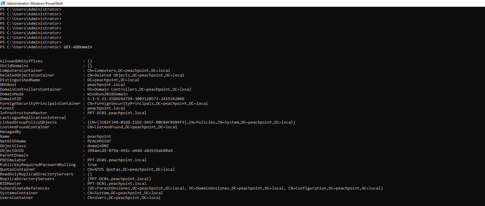
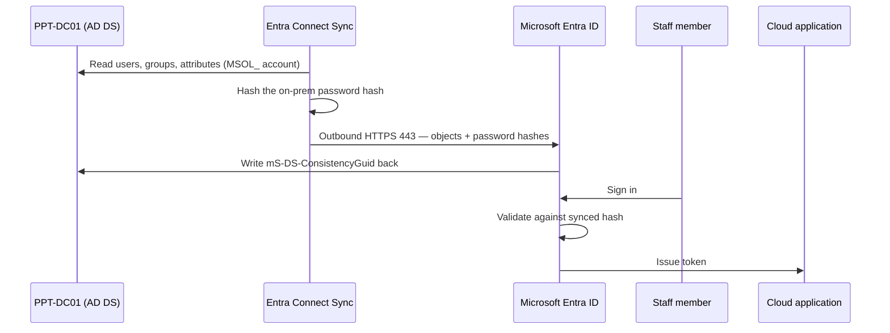

# 00 — Architecture

## Component inventory

| Component | Detail | Role |
|---|---|---|
| `PPT-DC01` | Windows Server 2022 | Domain controller, DNS |
| Network | `192.168.50.0/24`, host at `.101` (static) | Lab segment |
| Forest | `peachpoint.local`, new forest, NetBIOS `PEACHPOINT` | On-premises identity authority |
| Directory | 12 OUs, 21 users, 12 security groups | Identity objects |
| Entra Connect Sync | Installed on `PPT-DC01` | Synchronization engine |
| `MSOL_` connector account | Auto-created in AD | Directory read for sync |
| Entra ID tenant | "Peach Point Therapy" (identifiers redacted) | Cloud identity authority |
| `ppt-admin` | Cloud-only, Hybrid Identity Administrator | Sync configuration |
| Tailscale | WireGuard mesh | Out-of-band admin access |

## Identity data flow

The critical property: authentication is validated **inside Entra ID**, not on
premises. `PPT-DC01` can be offline and cloud sign-in still works. That is the
availability requirement from the scenario, satisfied by the choice of sign-in
method rather than by redundant hardware.

## Deliberate lab deviations from production

Documented so they are not mistaken for oversights.

| Deviation | Production would do | Why it is acceptable here |
|---|---|---|
| Entra Connect installed on the DC | Install on a domain-joined member server | Single-server lab; Microsoft guidance is a member server, and this would be a finding in an audit |
| One domain controller | Minimum two, separate hosts | Lab resource constraint; PHS mitigates the sign-in impact |
| `.local` forest suffix | Routable subdomain of an owned domain | See `05-upn-suffix-problem.md` |
| No object filtering before first sync | Exclude service accounts, disabled accounts, Domain Controllers OU | The full roster is the artifact being demonstrated |

## Diagram assets

Drop rendered topology images into `diagrams/`. The Mermaid blocks in this repo
render natively on GitHub, so image versions are optional polish rather than a
requirement.
