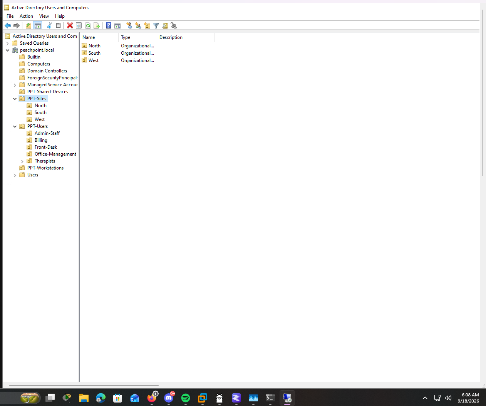
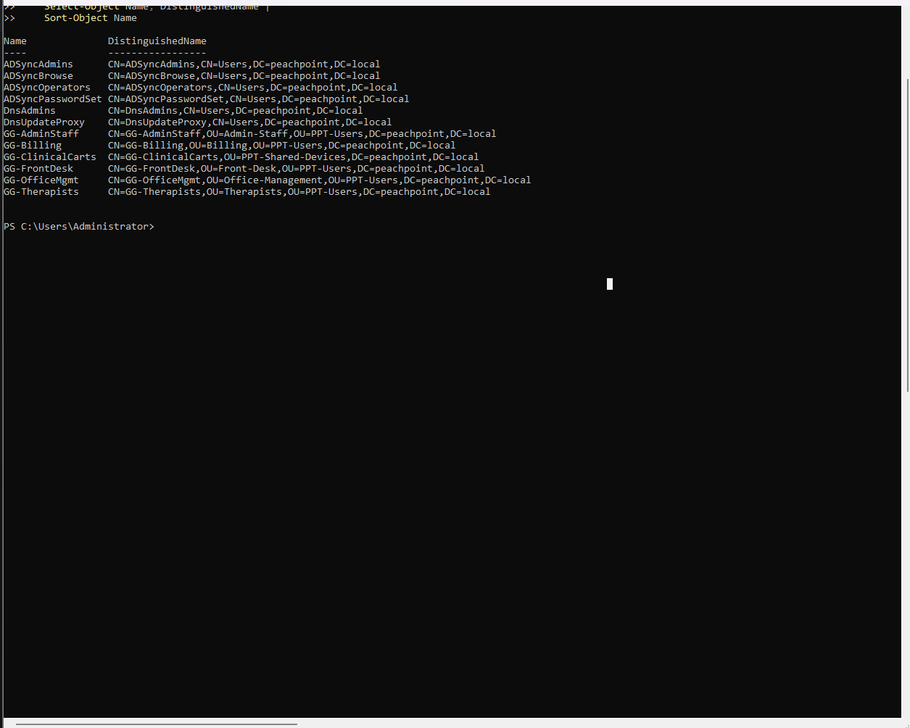
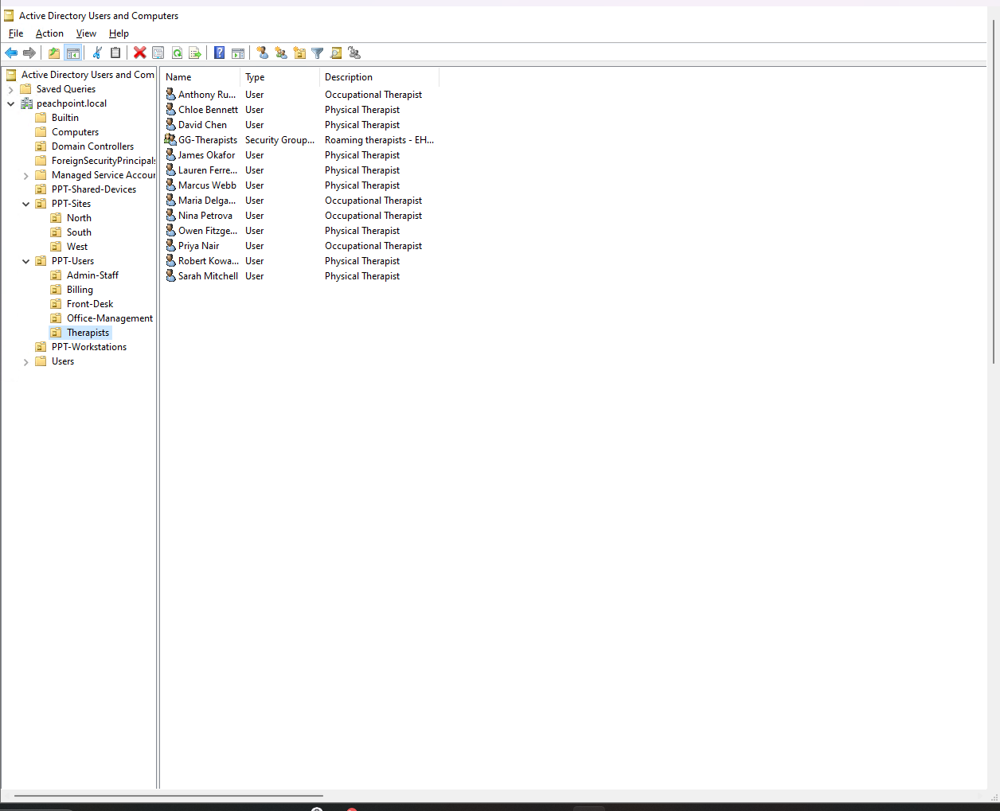

# 02 — Directory design

> **FILL IN** — this document needs your actual OU and group names from
> `PPT-DC01`. Everything else in the repo is complete. Run the export commands
> below and paste the results in, then delete this callout.

## Exporting the real structure

On `PPT-DC01`, in an elevated PowerShell session:

```powershell
# OU tree
Get-ADOrganizationalUnit -Filter * -SearchBase "DC=peachpoint,DC=local" |
    Select-Object Name, DistinguishedName |
    Sort-Object DistinguishedName |
    Format-Table -AutoSize

# Security groups with membership counts
Get-ADGroup -Filter { GroupCategory -eq "Security" } -SearchBase "DC=peachpoint,DC=local" -Properties Members |
    Select-Object Name, GroupScope, @{N='Members';E={ $_.Members.Count }} |
    Sort-Object Name |
    Format-Table -AutoSize

# User count per OU
Get-ADOrganizationalUnit -Filter * -SearchBase "DC=peachpoint,DC=local" | ForEach-Object {
    [pscustomobject]@{
        OU    = $_.Name
        Users = (Get-ADUser -Filter * -SearchBase $_.DistinguishedName -SearchScope OneLevel).Count
    }
} | Format-Table -AutoSize
```

## Design principles applied

The structure serves two targeting needs that pull in different directions.

**Group Policy targets naturally by location.** Printers, mapped drives, and
local security settings differ per clinic. A site-based OU structure makes GPO
linking straightforward.

**Access control targets naturally by role.** Under the minimum necessary
standard, a front desk employee and a billing specialist need different reach.
Role-based security groups make that expressible.

Structuring for only one of these makes the other painful, so the design does
both: **OUs carry location and administrative delegation; security groups carry
role and access.**

## OU structure

<!-- FILL IN: paste the OU tree export here -->

```
DC=peachpoint,DC=local
├── OU=...
├── OU=...
└── OU=...
```



## Security groups

<!-- FILL IN: paste the group export here -->

| Group | Scope | Members | Purpose |
|---|---|---|---|
| | | | |



## User roster

21 staff accounts distributed across the role structure described in
[`01-scenario.md`](01-scenario.md).

<!-- FILL IN: paste the per-OU user count export here -->



## Verification note

Post-sync, Entra ID reported **12 on-premises groups**. Confirm that all 12 are
intentional design objects rather than incidental groups that synced without being
filtered. Groups marked `isCriticalSystemObject` (Domain Admins, Enterprise Admins
and similar) are excluded by Entra Connect's default rules, so any surplus is more
likely to be a group created during the build than a built-in.

```powershell
# Every non-critical security group that is eligible to sync
Get-ADGroup -Filter { GroupCategory -eq "Security" } -Properties isCriticalSystemObject |
    Where-Object { -not $_.isCriticalSystemObject } |
    Select-Object Name, DistinguishedName |
    Sort-Object Name
```
