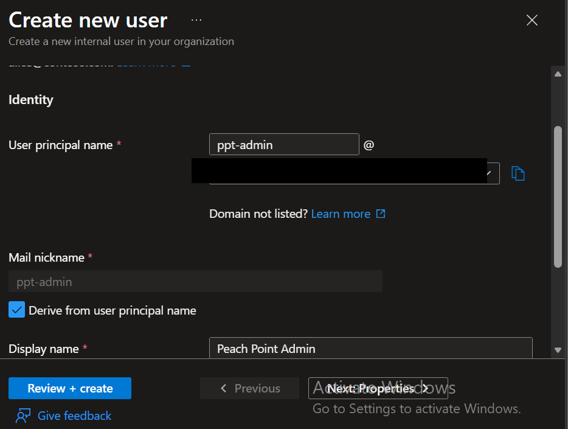
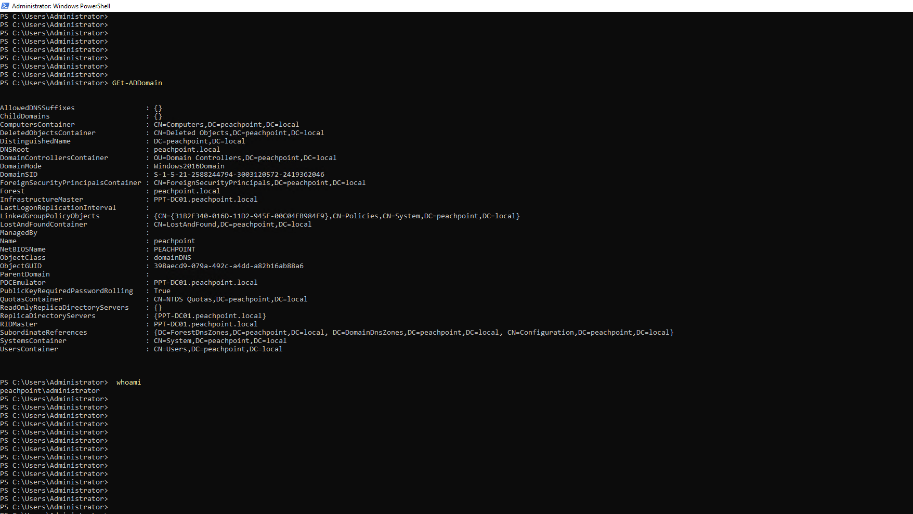
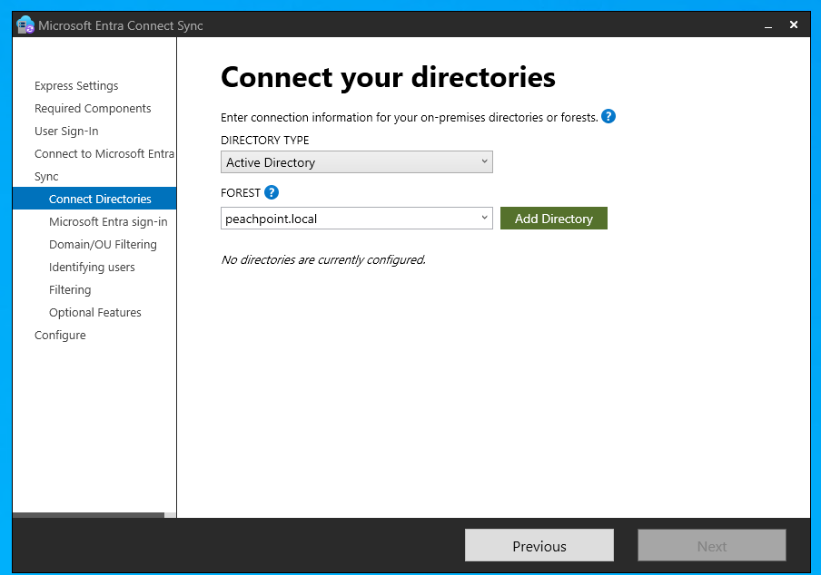
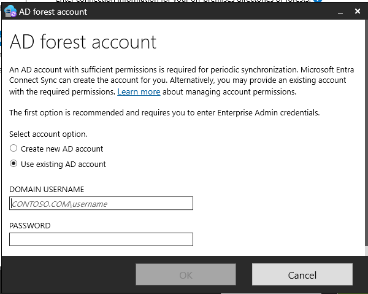
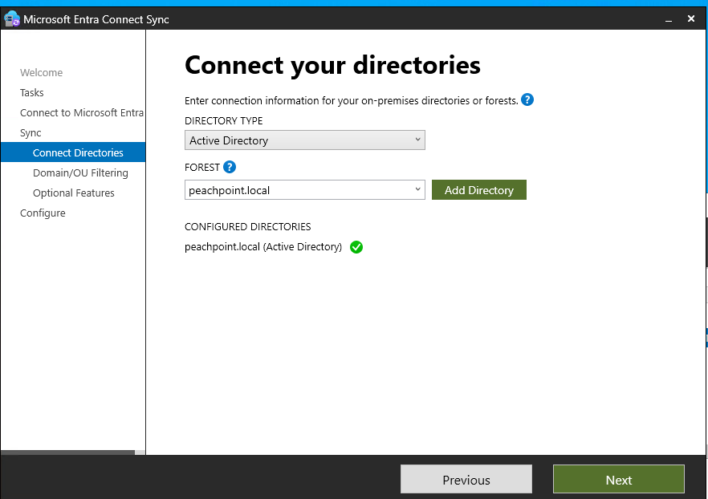
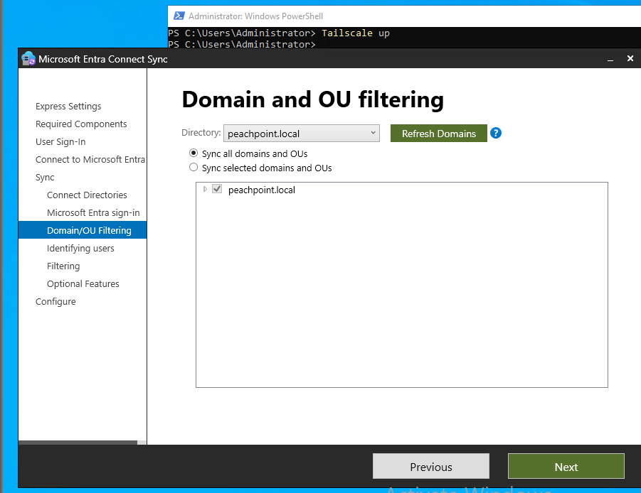
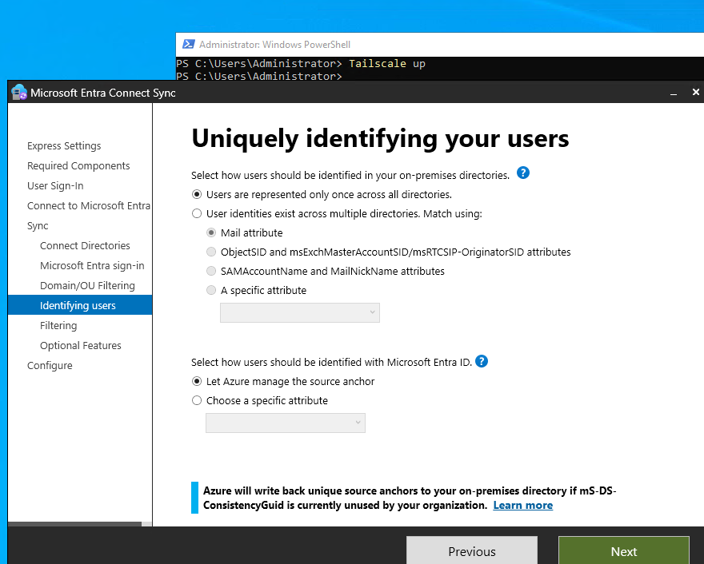
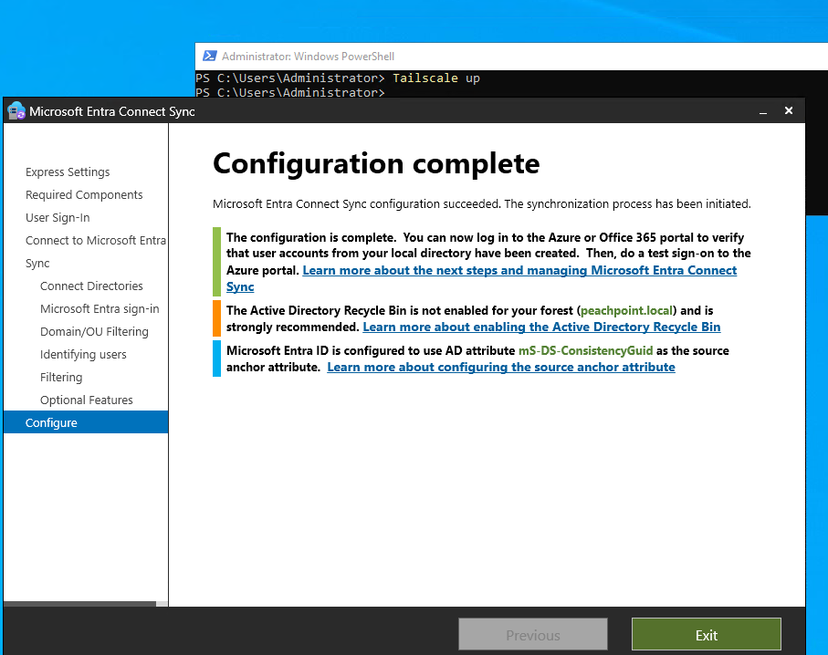

# 03 — Entra Connect Sync walkthrough

Every configuration screen, the value chosen, and the reason. Rationale for the
consequential choices is expanded in [`04-design-decisions.md`](04-design-decisions.md).

## Prerequisites completed first

| Item | Value |
|---|---|
| Cloud admin account | `ppt-admin`, **Hybrid Identity Administrator** |
| On-premises credentials | `PEACHPOINT\administrator` (Enterprise Admin) |
| Admin access path | RDP to `PPT-DC01` over Tailscale |

The cloud admin was created as a **native tenant account** rather than reusing the
personal Microsoft account that created the tenant. Guest and personal accounts
hit sign-in errors during Entra Connect authentication; a native account in the
tenant's own `.onmicrosoft.com` namespace resolves this cleanly and is the correct
pattern regardless.

---

## Screen 1 — Connect your directories

| Field | Value |
|---|---|
| Directory type | Active Directory |
| Forest | `peachpoint.local` |

### Troubleshooting note

Two errors surfaced here, both worth recording because they are common:

**"The domain specified in the credentials does not exist or cannot be contacted."**
Caused by supplying a bare username. The Enterprise Admin credential must be fully
qualified — either `PEACHPOINT\administrator` or `administrator@peachpoint.local`.
A bare `administrator` gives the wizard no domain to authenticate against.

**"The forest 'ppt-admin@…onmicrosoft.com' doesn't exist."**
The FOREST field was populated with the cloud sign-in UPN rather than the
on-premises forest name. These are different values and the field accepts either
without complaint. The forest field wants the **on-premises AD DNS name**.

---

## Screen 2 — AD forest account

| Field | Value |
|---|---|
| Account option | **Create new AD account** |
| Enterprise admin username | `PEACHPOINT\administrator` |

Entra Connect creates a dedicated `MSOL_` service account scoped precisely to the
directory read permissions the sync engine requires. Enterprise Admin credentials
are used **once, for creation only** — they are not the credentials the service
runs under.

---

## Screen 3 — Microsoft Entra sign-in configuration

| Field | Value |
|---|---|
| UPN suffix `peachpoint.local` | **Not Added** |
| On-premises attribute for username | `userPrincipalName` |
| Continue without matching UPN suffixes | **Checked** |

This is the most instructive screen in the build. Full analysis:
[`05-upn-suffix-problem.md`](05-upn-suffix-problem.md).

---

## Screen 4 — Domain and OU filtering

| Field | Value |
|---|---|
| Scope | **Sync all domains and OUs** |

The full 21-person roster is the artifact being demonstrated. Selective OU
filtering exists so large organizations can stage a rollout — real and important,
but purposeless at this scale.

**Production note:** a real deployment of this design would exclude service
accounts, disabled accounts, and the Domain Controllers OU before the first sync
cycle.

---

## Screen 5 — Uniquely identifying your users

| Field | Value |
|---|---|
| Identification across directories | **Users are represented only once** |
| Source anchor | **Let Azure manage the source anchor** (`mS-DS-ConsistencyGuid`) |

Single forest, so no cross-directory matching is needed. The source anchor choice
matters more than it appears — see [`04-design-decisions.md`](04-design-decisions.md).

---

## Screen 6 — Filter users and devices

| Field | Value |
|---|---|
| Scope | **Synchronize all users and devices** |

Group-scoped pilot filtering is for staged enterprise rollouts. Not applicable here.

---

## Screen 7 — Optional features

| Feature | State | Reason |
|---|---|---|
| **Password hash synchronization** | **Enabled** | Cloud sign-in survives a DC outage |
| Exchange hybrid deployment | Disabled | No Exchange in this environment |
| Exchange Mail Public Folders | Disabled | No Exchange |
| Entra ID app and attribute filtering | Disabled | No advanced scoping requirement |
| Password writeback | Disabled | Requires Entra ID P1 |
| Group writeback | Disabled | Requires Entra ID P1; no requirement |
| Device writeback | Disabled | Out of scope — no device management yet |
| Directory extension attribute sync | Disabled | No custom schema attributes |

---

## Screen 8 — Configuration complete

Three post-configuration messages, and what was done about each:

| Message | Action |
|---|---|
| Configuration succeeded; sync initiated | Verified — see [`06-validation.md`](06-validation.md) |
| AD Recycle Bin not enabled for `peachpoint.local` | Tracked in [`08-roadmap.md`](08-roadmap.md); `scripts/Enable-RecycleBin.ps1` |
| Source anchor is `mS-DS-ConsistencyGuid` | Expected — this was the intended selection |
