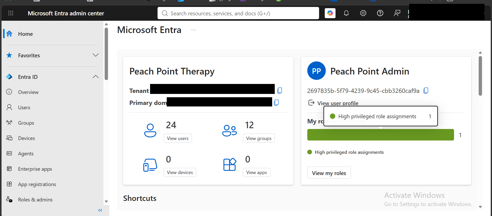
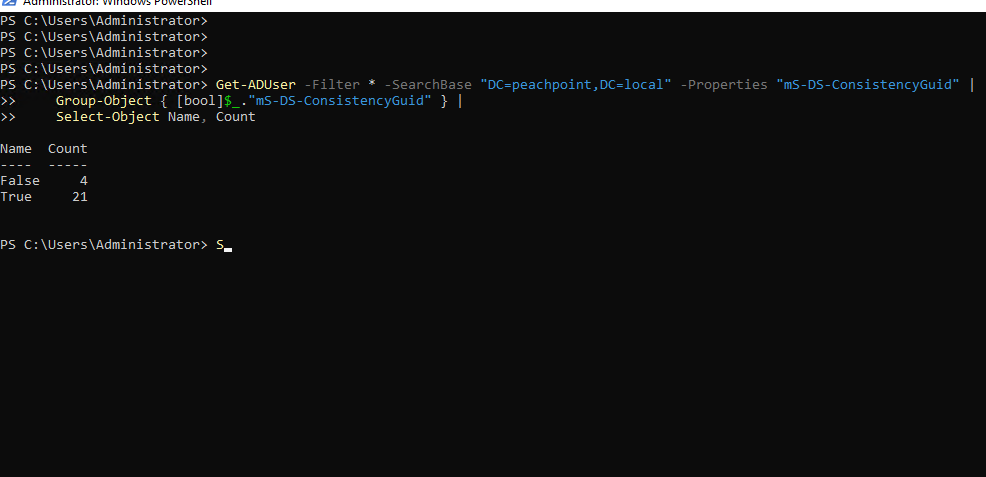

# 06 — Validation

Synchronization is not verified by the wizard saying it succeeded. It is verified
by reconciling object counts on both sides and accounting for every discrepancy.

## Tenant overview



| Metric | Value |
|---|---|
| Users | 24 |
| Groups | 12 |
| Devices | 0 |
| Enterprise applications | 0 |

`0` devices is expected — device sync and hybrid join are a later phase.

## Users — reconciling 21 against 24

The on-premises roster is 21 people. The tenant shows 24. Every one of the three
additional accounts is expected:

| Source | Count | Origin |
|---|---|---|
| Synchronized staff accounts | 21 | The full roster from `peachpoint.local` |
| `ppt-admin` | 1 | Cloud-only Hybrid Identity Administrator, created deliberately |
| `Sync_PPT-DC01_…` | 1 | Directory synchronization service account, auto-created by Entra Connect |
| Tenant founding account | 1 | The account used to create the tenant |

21 + 3 = 24. No unexplained objects.


**The reconciliation is the point.** A count that matches expectations proves
nothing on its own — what matters is being able to name the origin of every
object. An account that cannot be explained is either a misconfiguration or
something worse.

## Groups


| Metric | Value |
|---|---|
| Total groups | 12 |
| Security groups | 12 |
| **On-premises groups** | **12** |
| **Cloud-only groups** | **0** |
| Microsoft 365 groups | 0 |
| Dynamic groups | 0 |

The `0` cloud-only figure is the meaningful one. Every group in the tenant
originated on-premises, confirming a clean 1:1 mapping with nothing duplicated or
auto-generated during sync.

> **Open verification item:** confirm that all 12 on-premises groups are intended
> design objects rather than groups that synced without being filtered. Procedure
> in [`02-directory-design.md`](02-directory-design.md).

## Command-line verification

Run `scripts/Test-HybridIdentity.ps1` on `PPT-DC01`, or the checks directly:

```powershell
# On-premises object counts
(Get-ADUser  -Filter * -SearchBase "DC=peachpoint,DC=local").Count
(Get-ADGroup -Filter { GroupCategory -eq "Security" }).Count

# Source anchor coverage — proves Entra wrote the link back into AD
Get-ADUser -Filter * -Properties "mS-DS-ConsistencyGuid" |
    Group-Object { [bool]$_."mS-DS-ConsistencyGuid" } |
    Select-Object Name, Count

# Sync engine state
Get-ADSyncScheduler
Get-ADSyncConnectorRunStatus
```

Source anchor coverage is the strongest single signal: a populated
`mS-DS-ConsistencyGuid` on an on-premises user means Entra has established and
written back the link for that object. Users missing it have not synced.



Run against `peachpoint.local`: **21 users True, 4 False.** The 21 is the
entire staff roster — every real person has a written-back anchor. The 4
without one are `Administrator`, `Guest`, `krbtgt`, and the `MSOL_` sync
service account, none of which are expected to sync individually. No
unexplained objects on either side of this check.

## Forcing a sync cycle

```powershell
Import-Module ADSync
Start-ADSyncSyncCycle -PolicyType Delta      # changes only
Start-ADSyncSyncCycle -PolicyType Initial    # full resync
```

The default scheduler runs every 30 minutes. Manual cycles are for validation and
troubleshooting, not routine operation.
